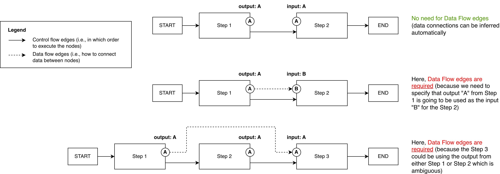
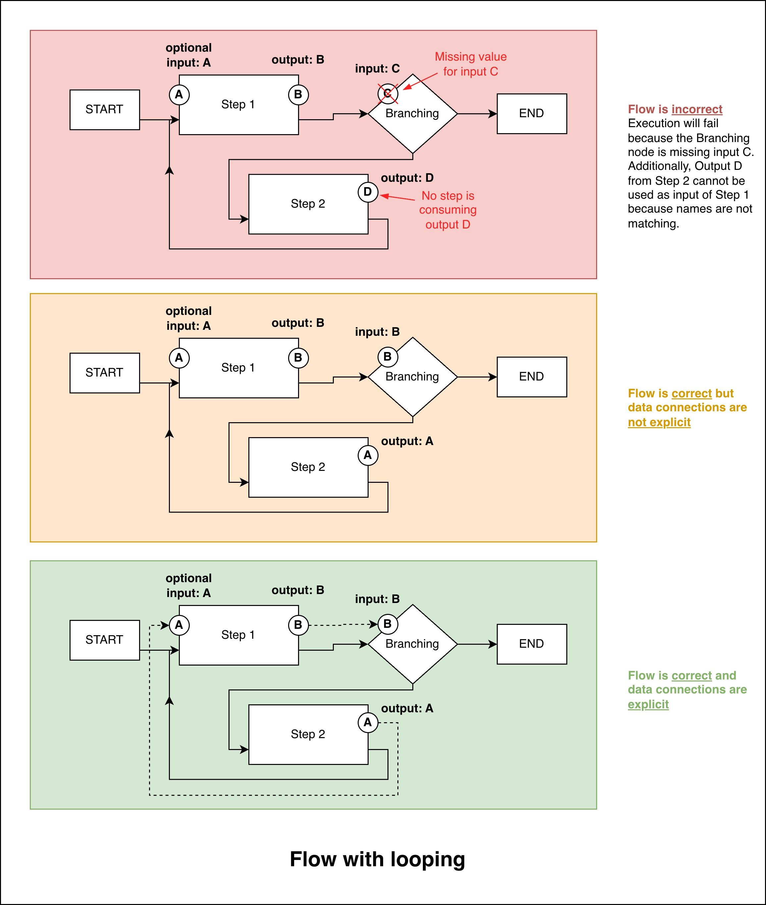

.. _conceptual_dataflowedges:

=====================================================
Data Flow Edges: What are they, when are they needed?
=====================================================

.. |python-icon| image:: ../../_static/icons/python-icon.svg
   :width: 40px
   :height: 40px

.. grid:: 2

    .. grid-item-card:: |python-icon| Download Python Script
        :link: ../end_to_end_code_examples/conceptual_dataflowedges.py
        :link-alt: Data Flow Edges how-to script

        Python script/notebook for this guide.

WayFlow enables the creation of different types of AI assistants including :ref:`Flows <flow>`,
which are great to use when you want to solve complex tasks with an orchestrated sequence of operations.

Building a Flow requires you to define a few different components, including the steps that make up the Flow,
the :ref:`Control Flow edges <controlflowedge>` between those steps (i.e., in which order should the steps be executed),
and finally the :ref:`Data Flow Edges <dataflowedge>` that define how data moves through the Flow.

Basics of Data Flow Edges
=========================

Data Flow Edges have one main purpose: defining how data outputs from one step are passed as inputs to another step.

In some simple Flows, WayFlow can automatically infer how data should flow between steps.
However, in more complex scenarios, you may need to explicitly define Data Flow Edges to ensure that data is routed correctly.

Here is a simple illustration to explain this concept:

We have three examples:

1. In the first Flow (at the top), the output from Step 1 is named the same way as the input of the Step 2 (A).
   Therefore, WayFlow can automatically infer that the output from Step 1 should be passed as input to Step 2.
2. In the second Flow (in the middle), Step 2's input is named differently (B) than Step 1's output (A).
   In this case, WayFlow cannot infer how data should flow between the two steps, and you need to explicitly
   define a Data Flow Edge to connect output A from Step 1 to input B of Step 2.
3. In the third Flow (at the bottom), both Step 1 and Step 2 expose an output named (A). WayFlow cannot infer
   which output should be passed to Step 3. Therefore, you need to define two Data Flow Edges: one connecting
   output A from Step 1 to Step 3, and another connecting output A from Step 2 to Step 3.

Data Flow Edges in Practice
===========================

Now let's see more concrete examples of how you can use Data Flow Edges in your Flows.

Example 1: Data routing with multiple outputs
---------------------------------------------

.. image:: ../_static/conceptual/dataflowedges_routing.jpg
    :align: center
    :scale: 27%
    :alt: Data Flow Edges for a Flow with data routing

In this first example, Step 1 produces an output that needs to be sent to two different steps: Step 2 and Step 3.

* When the name of the value is different between the steps (e.g., "A" and "B"), WayFlow cannot automatically
  infer the data routing, and you need to define Data Flow Edges explicitly.
* When the name of the value is shared between the steps (e.g. "A" in the middle Flow), WayFlow can automatically
  infer the data routing without the need to define Data Flow Edges.

.. tip::

    To improve the readability of your Flow definitions, it is recommended to always define Data Flow Edges explicitly,
    even when WayFlow can infer them automatically.

.. tabs::

    .. tab:: Code with automatic data routing

        .. literalinclude:: ../code_examples/conceptual_dataflowedges.py
            :language: python
            :start-after: .. start-##_Flow_with_multi_output_routing
            :end-before: .. end-##_Flow_with_multi_output_routing

    .. tab:: Code with explicit data routing

        .. literalinclude:: ../code_examples/conceptual_dataflowedges.py
            :language: python
            :start-after: .. start-##_Flow_with_multi_output_routing_with_explicit_edges
            :end-before: .. end-##_Flow_with_multi_output_routing_with_explicit_edges

Example 2: Looping Flows
------------------------

In this second example, we have a Flow that includes a loop.

Similar to the previous example:

* When the names of the values differ between the steps (example flow at the top), WayFlow cannot automatically
  infer the data routing, and you need to define Data Flow Edges explicitly.
* When the names of the values are shared between the steps (middle example), WayFlow can automatically
  infer the data routing without the need to define Data Flow Edges.

When creating looping Flows, it is generally recommended to define Data Flow Edges explicitly to avoid confusion.

.. tabs::

    .. tab:: Code with automatic data routing

        .. literalinclude:: ../code_examples/conceptual_dataflowedges.py
            :language: python
            :start-after: .. start-##_Flow_with_looping
            :end-before: .. end-##_Flow_with_looping

    .. tab:: Code with explicit data routing

        .. literalinclude:: ../code_examples/conceptual_dataflowedges.py
            :language: python
            :start-after: .. start-##_Flow_with_looping_with_explicit_edges
            :end-before: .. end-##_Flow_with_looping_with_explicit_edges

.. hint::

    You may have noticed that in the code for this looping flow, the input property **A** of **Step 1** has a default value.
    This is required because in the first loop iteration, the flow has yet to produce a value for **A**. Later in the execution
    of the flow, the **Step 2** produces a value for **A** which is then consumed by the **Step 1**.

Next steps
==========

Having learned about Data Flow Edges, you may now proceed to:

- :doc:`How to use Agents inside Flows <../howtoguides/howto_agents_in_flows>`

Full code
=========

Click on the card at the :ref:`top of this page <conceptual_dataflowedges>` to download the
full code for this guide or copy the code below.

.. literalinclude:: ../end_to_end_code_examples/conceptual_dataflowedges.py
    :language: python
    :linenos:
