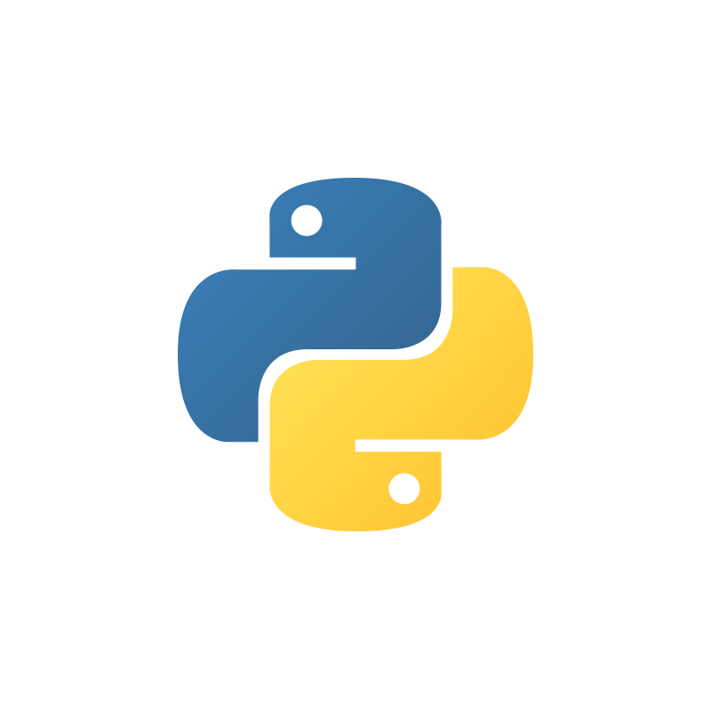

.. _top-howtoretryconfiguration:

======================================================
How to Configure Retries on LLMs and Remote Components
======================================================

.. grid:: 2

    .. grid-item-card:: |python-icon| Download Python Script
        :link: ../end_to_end_code_examples/howto_retry_configuration.py
        :link-alt: Retry configuration how-to script

        Python script/notebook for this guide.

.. admonition:: Prerequisites

    This guide assumes familiarity with:

    - :doc:`LLM configuration <llm_from_different_providers>`
    - :doc:`Using agents <agents>`
    - :doc:`Doing remote API calls <howto_remote_tool_expired_token>`

WayFlow remote components now share the same :ref:`RetryPolicy <retrypolicy>` object.
You can use it to configure retry timing and per-attempt request timeouts consistently across
:ref:`LLMs <llmmodel>`, :ref:`embedding models <embeddingmodel>`,
:ref:`ApiCallStep <apicallstep>`, :ref:`RemoteTool <remotetool>`,
remote MCP transports such as :ref:`StreamableHTTPTransport <streamablehttptransport>`,
:ref:`OciAgent <ociagent>`, and :ref:`A2AAgent <a2aagent>`.

Create a Retry Policy
=====================

Start by defining a ``RetryPolicy`` with the retry behavior you want to reuse.

.. literalinclude:: ../code_examples/howto_retry_configuration.py
    :language: python
    :start-after: .. start-##_Create_a_retry_policy
    :end-before: .. end-##_Create_a_retry_policy

Apply the Policy to Remote Components
=====================================

You can then pass the same retry policy to any supported remote component.

.. literalinclude:: ../code_examples/howto_retry_configuration.py
    :language: python
    :start-after: .. start-##_Configure_a_remote_LLM
    :end-before: .. end-##_Configure_a_remote_LLM

.. literalinclude:: ../code_examples/howto_retry_configuration.py
    :language: python
    :start-after: .. start-##_Configure_remote_steps_and_tools
    :end-before: .. end-##_Configure_remote_steps_and_tools

.. literalinclude:: ../code_examples/howto_retry_configuration.py
    :language: python
    :start-after: .. start-##_Configure_remote_agents_and_MCP_transports
    :end-before: .. end-##_Configure_remote_agents_and_MCP_transports

WayFlow applies ``request_timeout`` per attempt. Retries are limited to transient failures such
as configured recoverable status codes, eligible ``5xx`` responses, and connection errors.
Authentication failures, validation failures, and TLS/certificate verification failures are not retried.

Agent Spec Exporting/Loading
============================

You can export a configuration that includes the retry policy to Agent Spec using the ``AgentSpecExporter``.

.. literalinclude:: ../code_examples/howto_retry_configuration.py
    :language: python
    :start-after: .. start-##_Export_config_to_Agent_Spec
    :end-before: .. end-##_Export_config_to_Agent_Spec

Here is what the **Agent Spec representation will look like ↓**

.. collapse:: Click here to see the assistant configuration.

   .. tabs::

      .. tab:: JSON

         .. literalinclude:: ../config_examples/howto_retry_configuration.json
            :language: json

      .. tab:: YAML

         .. literalinclude:: ../config_examples/howto_retry_configuration.yaml
            :language: yaml

You can then load the configuration back with the ``AgentSpecLoader``.

.. literalinclude:: ../code_examples/howto_retry_configuration.py
    :language: python
    :start-after: .. start-##_Load_Agent_Spec_config
    :end-before: .. end-##_Load_Agent_Spec_config

Next steps
==========

Now that you have learned how to configure retries on remote components, you may proceed to
:doc:`How to Use OCI Generative AI Agents <howto_ociagent>` or
:doc:`How to Connect to A2A Agents <howto_a2aagent>`.

Full code
=========

Click on the card at the :ref:`top of this page <top-howtoretryconfiguration>` to download the full code for this guide or copy the code below.

.. literalinclude:: ../end_to_end_code_examples/howto_retry_configuration.py
    :language: python
    :linenos:
