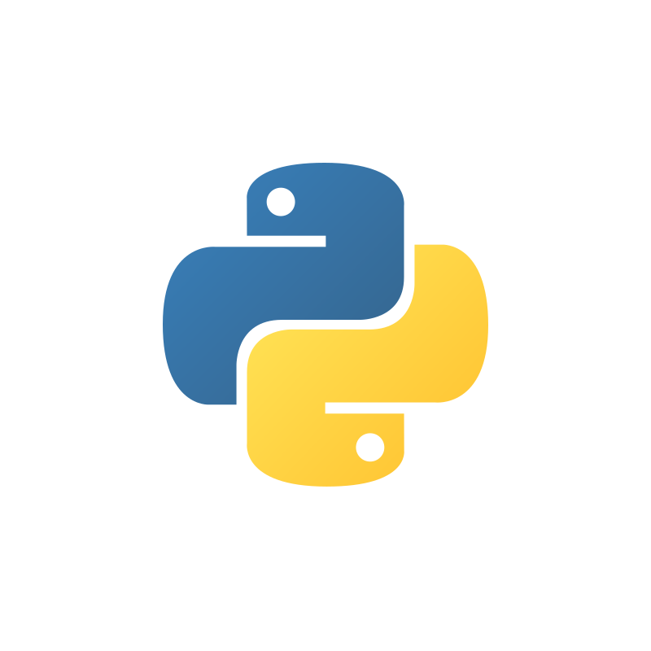

.. _top-howtoservecodeserver:

=================================
How to Run a Code Executor Server
=================================

.. grid:: 2

    .. grid-item-card:: |python-icon| Download Python Script
        :link: ../code_examples/howto_serve_codeserver.py
        :link-alt: Run a Code Executor Server how-to script

        Python script for this guide.

WayFlow provides a Code Executor Protocol and a compatible server for running Python scripts and
functions. The server exposes a small HTTP API for checking capabilities, submitting executions,
and polling execution results.

Start the server
================

Start a local Python Code Executor server with the WayFlow CLI:

.. code-block:: bash

    wayflow codeserver --host 127.0.0.1 --port 8765

The server is unauthenticated by default for local development. For deployments, put it behind
an authentication and TLS layer, and apply the resource limits appropriate for your environment.

Run the server in a container
=============================

You can also build and run the local Python Code Executor server with Podman or Docker. The
following is the container definition:

.. code-block:: Dockerfile

    ARG PYTHON_BASE_IMAGE=python:3.11-slim
    FROM ${PYTHON_BASE_IMAGE}

    ENV PYTHONUNBUFFERED=1
    WORKDIR /opt/wayflow

    COPY wayflowcore /opt/wayflow/wayflowcore
    COPY VERSION /opt/wayflow/VERSION

    RUN python3 -m pip install --no-cache-dir --upgrade pip \
        && python3 -m pip install --no-cache-dir -e /opt/wayflow/wayflowcore

    EXPOSE 8765

    CMD ["wayflow", "codeserver", "--host", "0.0.0.0", "--port", "8765"]

Build the image from the directory containing ``Containerfile.local-python-codeserver``:

.. tabs::

    .. tab:: Podman

        .. code-block:: bash

            podman build \
                -f Containerfile.local-python-codeserver \
                -t localhost/wayflow-code-server-local-python:dev .

        If Podman encounters SELinux labeling issues on RHEL, you may want to look into
        ``--security-opt`` configuration parameters.

    .. tab:: Docker

        .. code-block:: bash

            docker build \
                -f Containerfile.local-python-codeserver \
                -t wayflow-code-server-local-python:dev .

Run the container with an API key because it listens on all interfaces:

.. tabs::

    .. tab:: Podman

        .. code-block:: bash

            podman run --rm \
                --name wayflow-code-server \
                -p 8765:8765 \
                -e WAYFLOW_API_KEY='your-secret-key' \
                localhost/wayflow-code-server-local-python:dev

    .. tab:: Docker

        .. code-block:: bash

            docker run --rm \
                --name wayflow-code-server \
                -p 8765:8765 \
                -e WAYFLOW_API_KEY='your-secret-key' \
                wayflow-code-server-local-python:dev

Check server capabilities
=========================

The capabilities endpoint reports the languages and execution modes supported by the server.

.. literalinclude:: ../code_examples/howto_serve_codeserver.py
    :language: python
    :start-after: .. start-##_Get_capabilities
    :end-before: .. end-##_Get_capabilities

Run a script
============

Submit a script and wait for it to complete. Captured output is returned in the execution result.

.. literalinclude:: ../code_examples/howto_serve_codeserver.py
    :language: python
    :start-after: .. start-##_Run_script
    :end-before: .. end-##_Run_script

Run a function
==============

Submit source code containing one named function and pass JSON-compatible named arguments.

.. literalinclude:: ../code_examples/howto_serve_codeserver.py
    :language: python
    :start-after: .. start-##_Run_function
    :end-before: .. end-##_Run_function

Submit and poll an execution
============================

Set ``wait`` to ``False`` to receive an execution identifier immediately. Poll the execution
endpoint until it reaches a terminal status.

.. literalinclude:: ../code_examples/howto_serve_codeserver.py
    :language: python
    :start-after: .. start-##_Poll_execution
    :end-before: .. end-##_Poll_execution

Security considerations
=======================

The Code Executor server executes submitted source code. Do not expose an unauthenticated server
to an untrusted network. For production deployments, add authentication, TLS, rate limiting, and
resource controls through an API gateway, reverse proxy, or deployment-specific middleware.

Full code
=========

Click the card at the :ref:`top of this page <top-howtoservecodeserver>` to download the Python
example for this guide or copy the code below.

.. literalinclude:: ../code_examples/howto_serve_codeserver.py
    :language: python
    :linenos:
